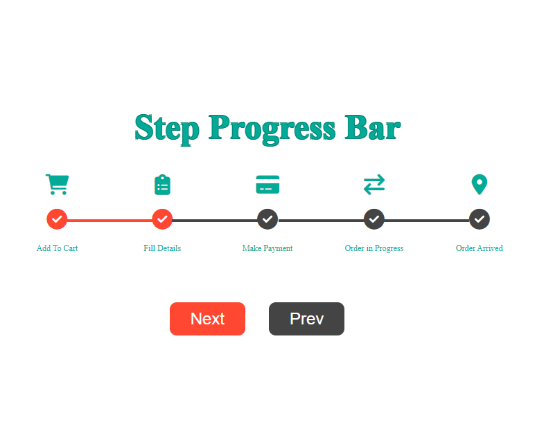

# Step Progress Bar

This project implements a step progress bar using HTML, CSS, and JavaScript. The progress bar allows users to visualize their progress through a series of steps and navigate between them.

## Features

- Step indicators with icons and titles represent each step of the process.
- The current active step is highlighted, while completed steps are marked with checkmarks.
- Users can navigate forward and backward through the steps using the "Next" and "Prev" buttons.

## Screenshot

## Getting Started

To run the project locally, follow these steps:

1. Clone the repository or download the source code.
2. Open the `index.html` file in a web browser.

## Dependencies

The project uses the following dependencies:

- Font Awesome (Version 6.2.0): Provides icons for the step indicators.

## Project Structure

- `index.html`: Contains the HTML structure of the step progress bar.
- `style.css`: Defines the styles for the step progress bar.
- `main.js`: Implements the JavaScript functionality for navigating between steps.

## Usage

- Click the "Next" button to advance to the next step in the progress bar.
- Click the "Prev" button to go back to the previous step.
- The active step will be highlighted, and completed steps will display a checkmark.

Feel free to modify the HTML, CSS, and JavaScript files to customize the appearance and behavior of the step progress bar according to your needs.

## Contributing

Contributions to the project are welcome. If you find any issues or have suggestions for improvements, please open an issue or submit a pull request.

